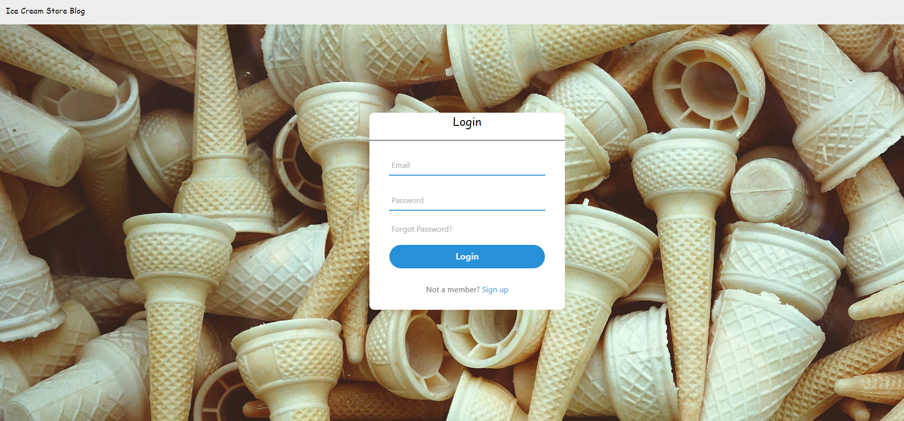

  # Ice Cream Store Blog
  
  
  
    
  
  ## Table-of-Contents
  * [Description](#description)
  * [Installation](#installation)
  * [Usage](#usage)
  * [Contributing](#contributing)
  * [Tests](#tests)
  * [Questions](#questions)
  
  
  ## [Description](#table-of-contents)
  We have come together for the love of Ice Cream and an Idea to start our own local Ice Cream Store. This application was made with the intent to gather information from internet users on all things Ice Cream

  ## [Usage](#table-of-contents)
  Application can be used through this Heroku Link -->

  ## [License](#table-of-contents)
  This application has the following license:
  
  [MIT](https://choosealicense.com/licenses/MIT)
    

  ## [Contributing](#table-of-contents)
  Contributions Done by: Brad Khune, Dustin Burns, and Kevin Pena
  
  ## [Questions](#table-of-contents)
  Contact me with any questions at the following:
  [GitHub](https://github.com/BurnsD)
  [Email: Dustin@Dustinburnsdev.com](mailto:Dustin@Dustinburnsdev.com)
  